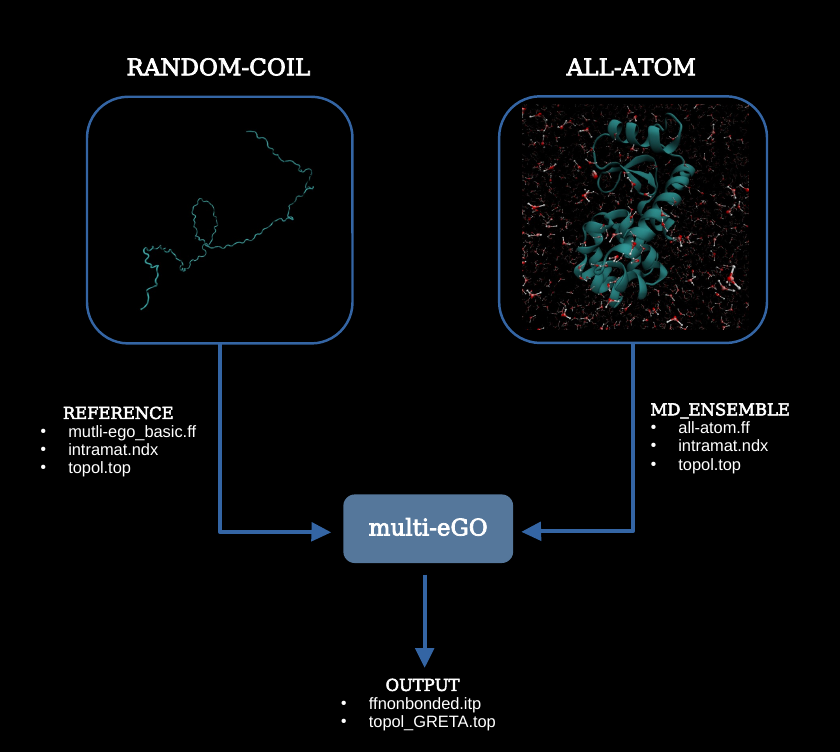

# Multi-*e*GO: a multi-ensemble Gō model

Version: **beta.1**  
Codename: **Vanessa**  
[](https://github.com/psf/black)
[](https://github.com/plumed/plumed2/actions)

## Current Developers:
- Fran Bacic Toplek
- Carlo Camilloni
- Riccardo Capelli
- Emanuele Scalone
- Bruno Stegani
  
Original version by Emanuele Scalone, Cristina Paissoni, and Carlo Camilloni, [Computational Structural Biology Lab](http://compsb.unimi.it), Department of Biosciences, University of Milano, Italy.

## Table of Contents
- [Requirements](#requirements)
- [Installation](#installation)
- [Usage](#usage)
- [Cite us](#cite-us)

## Requirements
Multi-*e*GO force-fields and tools are meant to be used with [GROMACS](https://www.gromacs.org), currently tested versions are 2021 to 2023.
You need to know how to compile GROMACS from source because some multi-eGO tools needs GROMACS recompilation.

## Installation
Use ```conda``` and the enviroment file provided as:
 ```
conda env create -f conda/environment.yml
conda activate meGO
```
It is also possible to use ```pip install -r requirements.txt```.

To install the `cmdata` gromacs tools: [ADD HOW TO]


## Usage
- [Prepare your first multi-eGO system](#prepare-your-first-multi-ego-system)
- [Setup of a multi-*e*GO random coil simulation](#setup-of-a-multi-ego-random-coil-simulation)
- [Analysis of a simulation: intramat.ndx](#analysis-of-a-simulation-intramatndx)
- [Setup of a multi-eGO production simulation](#setup-of-a-multi-ego-production-simulation)



### Prepare your first multi-*e*GO system

[Back to Usage](#usage)

The first step to perform a multi-*e*GO simulation is to generate a GROMACS topology file (.top). 
In a folder copy your PDB file and the ```multi-ego-basic.ff/``` included here, then run 
```
gmx pdb2gmx -f file.pdb -ignh
```
and select the multi-ego-basic force-field. From this you should get a (.gro) file for your structure and a (.top) topology file. In the ```multi-eGO/inputs``` folder add a folder for your system and a ```reference/``` subfolder. Copy your GROMACS topology in this ```reference/``` subfolder so that the final structure looks like ```multi-eGO/inputs/$SYSTEM_NAME/reference```

> [!NOTE]
> When using a system with disulfide bridges, it is as of version Vanessa (beta.1) necessary to remove the comments from ```ffbonded.itp``` in the ```multi-ego-basic.ff/``` folder and later to add them in the .top file.

### Setup of a multi-*e*GO random coil simulation

[Back to Usage](#usage)

Create a directory in which you wish to run the random coil simulation. In this directory, copy the ```multi-ego-basic.ff/``` folder and the .gro file generated in the previous step. To generate a random coil force field and associated topology run:
```
python multiego.py --system $SYSTEM_NAME --egos rc
```
```multiego.py``` will then generate an output directory in ```multi-eGO/outputs/${SYSTEM_NAME}_rc``` which will provide the inputs for the random coil simulation.
The contents of the output directory are ```ffnonbonded.itp``` and ```topol_GRETA.top```. The former is the non-bonded interactions file needs to be copied to the ```multi-ego-basic.ff/``` folder. The latter needs to be put into the simulation root directory. We provide mdps tested with various multi-*e*GO setups in the ```multi-eGO/mdps``` folder. The order in which the mdps are run is as follows:

```
    1. ff_em.mdp
    2. ff_cg.mdp
    3. ff_aa-posre.mdp
    4. ff_rc.mdp
```

### Analysis of a simulation: intramat.ndx

[Back to Usage](#usage)

Assuming that the simulation (random-coil or all-atom) is already run, two steps are necessary to learn the interactions from that simulation. First, we need to extract the contact data from the simulation. To do so, we have to install the ```cmdata``` tool found in ```multi-eGO/tools/cmdata/```. The tools is has to be used from [GROMACS](https://www.gromacs.org) as a part of the trajectory analysis tools. To do so, we can use the ```patch_gromacs.sh``` script by providing the gromacs root directory as the argument. The script will then patch the GROMACS installation with the cmdata tool. After this, we have to compile GROMACS. To do so, please refer to the [GROMACS installation guide](https://manual.gromacs.org/documentation/current/install-guide/index.html).
Using your patched GROMACS installation, we can now extract the contact data from the reference simulation. To do so, we run
```
gmx cmdata -f $YOUR_TRAJECTORY.xtc -s $YOUR_TOPOLOGY.tpr -sym aa_sym -histo
```
As you can see, we gave an additional input, the ```aa_sym``` file. This file is a list of the symmetric atoms in the system. We provide an example file in ```multi-eGO/tools/cmdata/aa_sym```. 
> [!WARNING]
> When using a deprotonated carboxy-terminus, it is necessary to add the carboxy-terminus to the ```aa_sym``` file. 

The output will be a collection of histograms in the form of .dat files. These files then need to be converted to intra- and intermat files. To do so, we use ```tools/make_mat/make_mat.py``` as follows assuming the histograms are in the in the md simulation directory in a subdirectory called ```histo/```:
```
python tools/make_mat/make_mat.py --histo $MD_DIRECTORY/histo --target_top $MD_DIRECTORY/topol.top --mego_top inputs/$SYSTEM_NAME/reference/topol.top --cutoff 0.75 --out inputs/$SYSTEM_NAME/md_ensemble # --proc 4 ## for multiprocessing
```
The same is to be done with the random coil simulation.
```
python tools/make_mat/make_mat.py --histo $RC_DIRECTORY/histo --target_top $RC_DIRECTORY/topol.top --mego_top inputs/$SYSTEM_NAME/reference/topol.top --cutoff 0.75 --out inputs/$SYSTEM_NAME/reference # --proc 4 ## for multiprocessing
```
The input directories will now contain the intramat files which contain the contact probabilities and distances as well as the cutoffs for each atom pair.

Finally, the directory structure should look like:

```
└── input
      └──  system_name
               ├── reference
               │      ├── topol.top
               │      ├── intramat_1_1.ndx
               │      └── multi-eGO_basic.ff
               └── md_ensemble
                      ├── topol.top
                      ├── intramat_1_1.ndx
                      └── all-atom.ff
```

### Setup of a multi-*e*GO production simulation 

[Back to Usage](#usage)

To setup a multi-*e*GO production simulation, we need to run ```multiego.py``` again. Before running the code, make sure that the topologies of your systems all share the same moleculetype name. If they do not, you can change the name in the ```topol.top``` file. If they do not the program will crash.
```
python multiego.py --system $SYSTEM_NAME --egos production --epsilon 0.3 --train_from md_ensemble
```
We set the energy scale &#949; to 0.3 kJ/mol and we train the model from the ```md_ensemble```. The output directory will be ```multi-eGO/outputs/${SYSTEM_NAME}_production_e0.3_0.3``` and will contain the inputs for the production simulation. Again, the contents of the output directory are ```ffnonbonded.itp``` and ```topol_GRETA.top``` and need to be copied to the ```multi-ego-basic.ff/``` folder and the simulation root directory. The mdps are the same except for the last step which is now ```ff_aa.mdp```.

Happy simulating :)

## Cite us
1. Scalone, E., et al. [Multi-eGO: An in silico lens to look into protein aggregation kinetics at atomic resolution.](https://www.pnas.org/doi/10.1073/pnas.2203181119) Proc Natl Acad Sci USA 119, e2203181119 (2022) preprint available: [bioRxiv](https://www.biorxiv.org/content/10.1101/2022.02.18.481033v2)
2. Bacic Toplek, F., Scalone, E., et al. [Multi-eGO: model improvements towards the study of complex self-assembly processes.]() preprint available: [chemRxiv](https://doi.org/10.26434/chemrxiv-2023-67255)

